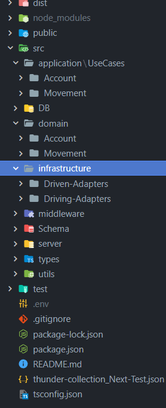

# Prueba Next

## Desafio - Prueba Bancaria.
El desafio consta de la creacion de distintas funcionalidades emulando un comportamiento bancario.

### Arquitectura de proyecto.
Proyecto realizado en Typescript mediante aplicacion de clean architecture.

### Middlewares
La aplicacion consta de 3 middlewares utilizados para verificar que se hayan cumplido determinadas acciones antes de continuar. Estos son:
1. Verificar que para realizar cualquier accion, el usuario deba de estar logeado. El logeo de usuario emula la introduccion de la tarjeta debito/credito en un cajero automatico. Para ello se deben brindar 3 datos que se encuentran grabados en cualquier tarjeta.
  - IBAN
  - Type (El tipo de tarjeta credito o debito)
  - PIN
2. El siguiente middleware sirve para frenar bloquear las actividades en caso de que la tarjeta no se encuentra activada. Para poder continuar debemos activar a travez de la ruta especifica.
3. Una vez pasado los dos anteriores, solicitara el cambio del PIN por primera vez. El nuevo PIN debe tener las siguientes caracteristicas:
  - Minimo 8 caracteres
  - Maximo 15 caracteres
  - Al menos una letra mayúscula
  - Al menos una letra minucula
  - Al menos un dígito
  - No espacios en blanco
  - Al menos 1 caracter especial

### Rutas
Se disponen de las siguientes rutas
1. Rutas de Account
  - '/login/' --> Utilizada para el logeo de cuenta del usuario
  - '/activate/' --> Ruta de activacion de tarjtea
  - '/changepin/' --> Ruta de modificacion de pin
2. 
  - '/movements/' --> Ruta utilizada para obtener los movimientos de cuenta asociados al usuario logeado. 
  - '/deposit/' --> Ruta de deposito. Solo valida para cuando se quiere depositar dinero desde el mismo banco. No funcionara si se desea depositar desde otro banco diferente al del usuario
  - '/extract/' --> Ruta de extraciones. Limitada al tipo de tarjeta, como asi tambien fondos disponibles y limits de extracion
  - '/transfer/' --> Ruta de transferencia. Incluye validacion de IBAN de destinatario. 

### Sesion de usuario.
Se ha implementado medinate Express-session una sesion de usuario lo que me permite a lo largo de la experiencia obtener los datos del usuario para los momentos necesarios en su implementacion.

### Utils
Se hace uso de Bcrypt para la encriptacion del pin de acceso. 
Tambien se utiliza Joi para la validacion de Login

### BD
Se ha utilizado 2 DB Mock, una que representara los movimientos (Ingreso, Engresos, Transferencias) y otra que representa los datos de cada usuario.

### Usuario de prueba
1. Albert Estein

IBAN: "ES123456789"
type: (aqui puede usar credit o debit)
pin: "AlbertEinstein"

2. NikolaTesla

IBAN: "ES987654321",
type: (aqui puede usar credit o debit) 
pin: "NikolaTesla"

### Test
Se incluyen 4 test a las rutas de deposito, cambio de pin, logeo y activacion de tarjeta.

### Thunder Client Collection
Se agregan la coleccion con los testeos de rutas realizados en thunderclient para utilizar si se desea.